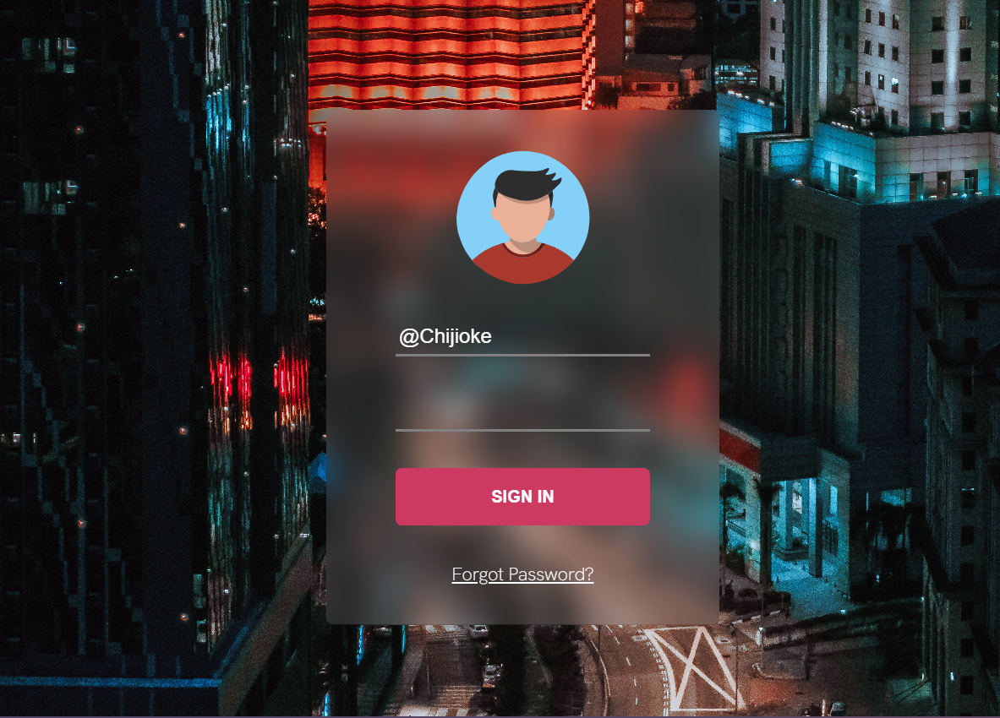

# My backdrop property design

## Table of contents

- [Links](#links)
- [My process](#my-process)
- [Built with](#built-with)

### Links

- [Solution URL](https://github.com/diegosticks/backdrop-css)
- [Live site URL](https://chijiokerbackdrop-css.netlify.app/)

## My process
-  This is a project to show the backdrop property of css, check my css file to see the implementation.

### Built with

- Semantic HTML5 markup
- CSS custom properties
- Flex